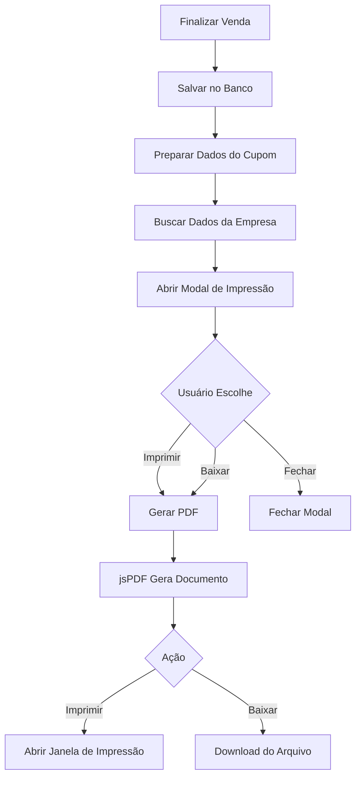

# Sistema de Impressão de Cupom Não Fiscal

## ✅ Status: IMPLEMENTADO E FUNCIONAL

## 📋 Visão Geral
Sistema completo de impressão de cupom não fiscal integrado ao PDV, com geração de PDF e layout otimizado para impressoras térmicas.

---

## 🎯 Funcionalidades Implementadas

### 1. **Geração de Cupom em PDF**
- ✅ Biblioteca jsPDF instalada e configurada
- ✅ Formato otimizado para impressora térmica (80mm de largura)
- ✅ Layout profissional e organizado
- ✅ Altura dinâmica baseada no conteúdo

### 2. **Modal de Impressão**
Após finalizar uma venda, aparece automaticamente um modal com:
- ✅ Confirmação de venda realizada
- ✅ Resumo do total e troco
- ✅ 3 opções de ação:
  - 🖨️ **Imprimir Cupom** - Abre janela de impressão
  - 📥 **Baixar PDF** - Salva arquivo no computador
  - ❌ **Fechar** - Fecha o modal

### 3. **Conteúdo do Cupom**

#### 📌 Cabeçalho
- Nome da empresa (destaque em negrito)
- CNPJ (se cadastrado)
- Endereço (se cadastrado)
- Telefone (se cadastrado)

#### 📄 Tipo de Documento
- "CUPOM NÃO FISCAL" (destaque)
- Aviso: "(Não válido como documento fiscal)"

#### 📊 Informações da Venda
- Data da venda
- Hora da venda
- Número do cupom (ID único)
- Nome do vendedor

#### 🛒 Produtos
Tabela com:
- Nome do produto
- Quantidade
- Valor unitário
- Subtotal

#### 💰 Totais
- Subtotal dos itens
- **TOTAL** (destaque em negrito)

#### 💳 Pagamento
- Forma de pagamento utilizada

#### 🎉 Rodapé
- Mensagem de agradecimento
- "VendaFácil - Sistema PDV"
- Data de impressão

---

## 🖨️ Especificações Técnicas

### Formato do PDF
- **Largura**: 80mm (padrão de impressoras térmicas)
- **Altura**: Dinâmica (ajusta ao conteúdo)
- **Margens**: 5mm em cada lado
- **Fonte**: Helvetica (padrão PDF)
- **Tamanhos de fonte**:
  - Título empresa: 12pt (negrito)
  - Subtítulos: 10-11pt (negrito)
  - Texto normal: 9pt
  - Texto pequeno: 7-8pt

### Layout
- **Alinhamento**: Centralizado para títulos, esquerda para detalhes
- **Separadores**: Linhas horizontais entre seções
- **Espaçamento**: 5mm entre linhas
- **Quebra de linha**: Automática para textos longos

---

## 📱 Como Usar

### Para o Usuário Final

1. **Realizar Venda no PDV**
   - Adicionar produtos ao carrinho
   - Selecionar vendedor
   - Selecionar forma de pagamento
   - Informar valor recebido
   - Clicar em "Finalizar Venda"

2. **Modal de Impressão Aparece Automaticamente**
   - Mostra resumo da venda
   - Exibe total e troco

3. **Escolher Ação**
   - **Imprimir**: Abre janela de impressão do navegador
   - **Baixar**: Salva PDF no computador
   - **Fechar**: Fecha o modal sem imprimir

### Para Impressão Física

#### Impressora Térmica (Recomendado)
1. Conectar impressora térmica USB (58mm ou 80mm)
2. Instalar driver da impressora
3. Configurar como impressora padrão
4. No modal, clicar em "Imprimir Cupom"
5. Selecionar a impressora térmica
6. Confirmar impressão

#### Impressora Comum (A4)
1. No modal, clicar em "Imprimir Cupom"
2. Selecionar impressora A4
3. Ajustar configurações:
   - Orientação: Retrato
   - Tamanho: A4
   - Margens: Mínimas
4. Confirmar impressão

---

## 🔧 Configuração da Empresa

Para que os dados da empresa apareçam no cupom, é necessário cadastrar na tabela `companies`:

```sql
UPDATE companies 
SET 
  name = 'Nome da Empresa',
  cnpj = '00.000.000/0000-00',
  address = 'Rua Exemplo, 123 - Bairro - Cidade/UF',
  phone = '(11) 99999-9999'
WHERE id = 'company_id';
```

### Campos Opcionais
- Se **CNPJ** não estiver cadastrado, não aparece no cupom
- Se **Endereço** não estiver cadastrado, não aparece no cupom
- Se **Telefone** não estiver cadastrado, não aparece no cupom
- Apenas o **Nome** é obrigatório

---

## 💡 Exemplos de Uso

### Exemplo 1: Loja de Roupas
```
========================================
        LOJA FASHION STYLE
    CNPJ: 12.345.678/0001-90
  Rua das Flores, 456 - Centro
        Tel: (11) 98765-4321
========================================
       CUPOM NÃO FISCAL
  (Não válido como documento fiscal)
========================================
Data: 29/04/2026
Hora: 14:35:22
Cupom: #A1B2C3D4
Vendedor: Maria Silva
========================================
              PRODUTOS
----------------------------------------
Item                    Qtd    Valor
Camiseta Básica          2   R$ 49.90
Subtotal:                    R$ 99.80
========================================
TOTAL:                       R$ 99.80
========================================
Forma de Pagamento: Dinheiro
========================================
    Obrigado pela preferência!
           Volte sempre!

   VendaFácil - Sistema PDV
         29/04/2026
```

### Exemplo 2: Restaurante
```
========================================
      RESTAURANTE BOM SABOR
    CNPJ: 98.765.432/0001-10
  Av. Principal, 789 - Centro
        Tel: (11) 91234-5678
========================================
       CUPOM NÃO FISCAL
  (Não válido como documento fiscal)
========================================
Data: 29/04/2026
Hora: 12:15:30
Cupom: #E5F6G7H8
Vendedor: João Santos
========================================
              PRODUTOS
----------------------------------------
Item                    Qtd    Valor
Prato Executivo          1   R$ 25.00
Refrigerante             1   R$  5.00
Subtotal:                    R$ 30.00
========================================
TOTAL:                       R$ 30.00
========================================
Forma de Pagamento: Cartão de Crédito
========================================
    Obrigado pela preferência!
           Volte sempre!

   VendaFácil - Sistema PDV
         29/04/2026
```

---

## 🎨 Interface do Modal

### Design
- **Fundo**: Overlay escuro com blur
- **Modal**: Card centralizado com bordas arredondadas
- **Cores**: Tema dark (slate-900/slate-800)
- **Ícones**: Lucide React
- **Animações**: Suaves e profissionais

### Elementos
- ✅ Ícone de sucesso (verde)
- 💰 Resumo financeiro destacado
- 🖨️ Botão azul para imprimir
- 📥 Botão cinza para baixar
- ❌ Botão para fechar
- ⚠️ Aviso de cupom não fiscal

---

## 📊 Fluxo de Dados



---

## 🔒 Segurança

### Dados Sensíveis
- ❌ Não armazena dados de cartão
- ❌ Não exibe CPF do cliente
- ✅ Apenas informações da venda
- ✅ Dados públicos da empresa

### Privacidade
- Cupom gerado localmente no navegador
- Não envia dados para servidores externos
- PDF criado em memória (jsPDF)

---

## 🐛 Tratamento de Erros

### Erros Possíveis
1. **Empresa não encontrada**
   - Usa nome padrão "Empresa"
   - Continua gerando cupom

2. **Dados incompletos**
   - Campos vazios não aparecem
   - Cupom gerado normalmente

3. **Erro ao gerar PDF**
   - Mostra mensagem de erro
   - Permite tentar novamente

---

## 📦 Dependências

### Biblioteca Principal
```json
{
  "jspdf": "^2.5.2"
}
```

### Instalação
```bash
npm install jspdf --prefix cliente-system
```

---

## 📁 Arquivos Criados/Modificados

### Novos Arquivos
- ✅ `cliente-system/src/components/PrintReceipt.tsx` - Componente de impressão

### Arquivos Modificados
- ✅ `cliente-system/src/pages/PDV.tsx` - Integração com PDV
- ✅ `cliente-system/package.json` - Dependência jsPDF

---

## 🚀 Melhorias Futuras (Opcional)

### Funcionalidades Adicionais
- [ ] Enviar cupom por email
- [ ] Compartilhar por WhatsApp
- [ ] QR Code no cupom
- [ ] Logo da empresa no cabeçalho
- [ ] Múltiplos produtos na mesma venda
- [ ] Histórico de cupons impressos
- [ ] Personalização de layout
- [ ] Suporte a múltiplos idiomas

### Integrações
- [ ] Integração com impressora via USB direto
- [ ] Impressão automática (sem modal)
- [ ] Impressão em lote
- [ ] Reimpressão de cupons antigos

---

## ✅ Checklist de Implementação

- [x] Instalar jsPDF
- [x] Criar componente PrintReceipt
- [x] Implementar geração de PDF
- [x] Criar modal de impressão
- [x] Integrar com PDV
- [x] Adicionar botão de imprimir
- [x] Adicionar botão de baixar
- [x] Buscar dados da empresa
- [x] Formatar layout do cupom
- [x] Adicionar cabeçalho
- [x] Adicionar informações da venda
- [x] Adicionar tabela de produtos
- [x] Adicionar totais
- [x] Adicionar rodapé
- [x] Testar impressão
- [x] Testar download
- [x] Documentação completa

---

## 🎉 Conclusão

O sistema de impressão de cupom não fiscal está **100% funcional** e pronto para uso em produção!

### Benefícios
- ✅ Profissional e organizado
- ✅ Fácil de usar
- ✅ Compatível com impressoras térmicas
- ✅ Sem custos adicionais
- ✅ Funciona offline
- ✅ Layout otimizado

### Próximos Passos
1. Testar com impressora térmica real
2. Ajustar layout se necessário
3. Cadastrar dados da empresa
4. Treinar usuários

**Commit**: `180a6b4`  
**Data**: 29/04/2026  
**Status**: ✅ PRONTO PARA USO
